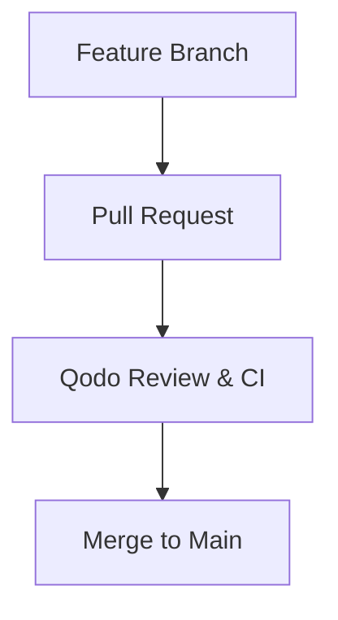

# Git Workflow & Review Policy

Even when developing with Antigravity AI, all development follows a strict Git workflow:

## Mandatory Workflow Steps

1. **Feature Branch**:
   - Always create a dedicated branch off `main` before starting new features or bug fixes.
   - Naming convention: `feat/<feature-name>`, `fix/<bug-name>`, `refactor/<scope>`.

2. **Pull Request (PR)**:
   - Commit changes with conventional commit messages (`feat:`, `fix:`, `chore:`, `refactor:`).
   - Prepare structured PR descriptions covering:
     - **Summary**: Concise overview of changes.
     - **Components Affected**: Detailed file and feature list.
     - **Test Plan & Verification**: Automated and manual verification steps.

3. **Qodo Review**:
   - Every PR undergoes Qodo automated review (security checks, edge cases, test coverage, code suggestions).
   - Address any Qodo review feedback or critical remarks before merging.

4. **Merge**:
   - Squash & merge or rebase merge to `main` only after CI checks and review verification pass.
