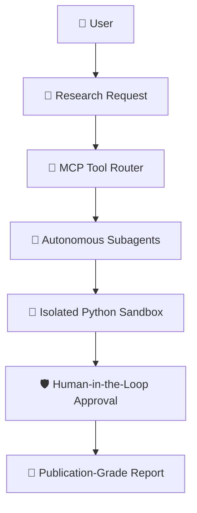

# Hackathon Roles & TrueForge Architecture

## 🎯 Role Division for Hackathon

| Role / Tool | Purpose in Project |
| :--- | :--- |
| **Antigravity** | High-velocity coding assistant for rapid, pristine implementation. Does NOT make unilateral architecture decisions. |
| **GitHub** | Source of truth. Strict Git workflow (Feature Branch → PR → Qodo Review → Merge). |
| **Qodo** | Verifiable code quality proof, automated PR review, and security/edge-case validation. |
| **TrueForge** | **The product judges actually evaluate.** Multi-agent deep research intelligence engine. |

---

## ⚡ Main TrueForge Execution Pipeline

Every research operation follows this deterministic 7-stage chain:

### Pipeline Details:
1. **User**: Inputs research objective, constraints, and hypothesis.
2. **Research Request**: Decomposed into structured vector inquiries and domain filters.
3. **MCP Tool (Model Context Protocol)**: Dispatches tool calls to external endpoints (`mcp://arxiv/search`, `mcp://uspto/claims`, `mcp://sec-edgar/parse`, `mcp://crossref/doi`).
4. **Subagents**: Specialized worker agents (Web Crawler, Company Specs Agent, Competitor Agent, Market TAM Agent).
5. **Sandbox**: Executes isolated Python scripts for numerical triangulation, Monte Carlo simulations, and contradiction resolution.
6. **Approval**: Human-in-the-loop checkpoint where researchers verify grounded citations and approve the synthesis.
7. **Report**: Publication-grade dossier with interactive knowledge graphs, verified BibTeX records, and executive audio briefings.
